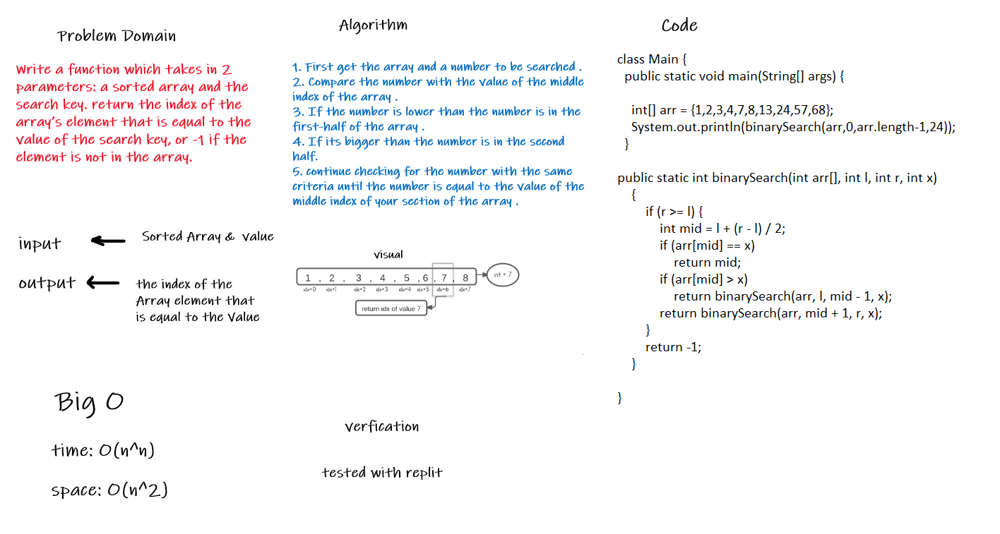

# array-binary-search

## To Do

Write a function called BinarySearch which takes in 2 parameters: a sorted array and the search key. Without utilizing any of the built-in methods available to your language, return the index of the array’s element that is equal to the value of the search key, or -1 if the element is not in the array.

## Whiteboard Process

## the Code :

class Main { public static void main(String[] args) { int[] arr = {1,2,3,4,7,8,13,24,57,68};
    System.out.println(binarySearch(arr,0,arr.length-1,24));
}

public static int binarySearch(int arr[], int l, int r, int x)
{
if (r >= l) {
int mid = l + (r - l) / 2;
if (arr[mid] == x)
return mid;
if (arr[mid] > x)
return binarySearch(arr, l, mid - 1, x);
return binarySearch(arr, mid + 1, r, x);
}
return -1;
}
}
