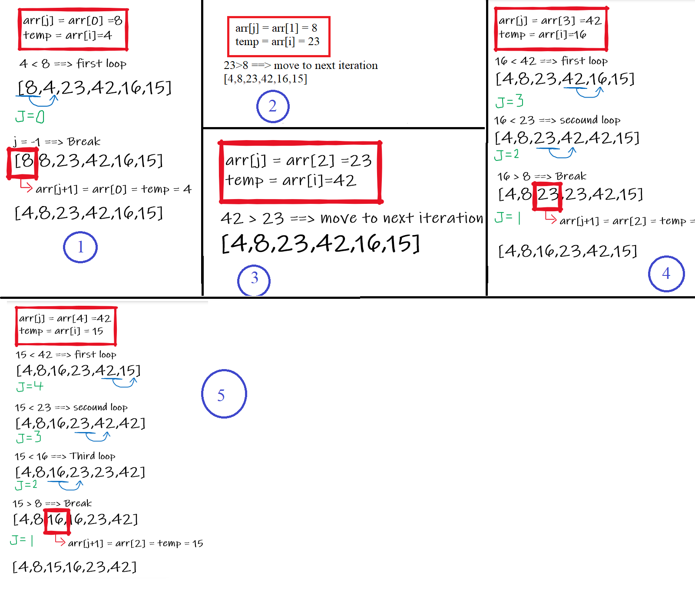

# Insertion Sort

a simple sorting algorithm that builds the final sorted array (or list) one item at a time. It is much less efficient on large lists than more advanced algorithms such as quicksort, heapsort, or merge sort.

## Pseudocode

```
  InsertionSort(int[] arr)

    FOR i = 1 to arr.length

      int j <-- i - 1
      int temp <-- arr[i]

      WHILE j >= 0 AND temp < arr[j]
        arr[j + 1] <-- arr[j]
        j <-- j - 1

      arr[j + 1] <-- temp
```

## Trace

Sample Array: [8,4,23,42,16,15]

**Pass 1:**

j=0;

temp=4;

will compare the 4 with 8, when it's less than 8, will assign it equal to 8 and minus 1 from j to become -1 and break the while loop.

then assign arr[j+1] the value of temp which is 4.


**Pass 2:**

j=1;

temp=23;

while temp is grater than 4 (the previous value) will move to the next iteration.


**Pass 3:**

j=2;

temp=42;

while temp is grater than 23 (the previous value) will move to the next iteration.


**Pass 4:**

j=3;

temp=16;

will compare the 16 with 42, when it's less, will assign it equal to 42 and minus 1 from j to become 2, then compare again 16 is less than 23, so will assign the value of arr[j+1] to be equal 23. then compare again 16 is grater than 8 so will break the loop and assign the value of arr[j+1] to be equal the temp which is 16.


**Pass 5 (the last iteration):**

j=4;

temp=15;

will compare the 15 with 42, when it's less, will assign it equal to 42 and minus 1 from j to become 2, then compare again 15 is less than 23, so will assign the value of arr[j+1] to be equal 23, then compare again 15 is less than 16, so will assign the value of arr[j+1] to be equal 16. then compare again 15 is grater than 8 so will break the loop and assign the value of arr[j+1] to be equal the temp which is 15.



After this iteration, i will increment to 6, forcing it to break out of the outer for loop and leaving our array now sorted.

## Efficency

- **Time: `O(n^2)`:**

  The basic operation of this algorithm is comparison. This will happen `n*(n-1)` number of times…concluding the algorithm to be n squared.

- **Space: `O(1)`:**

  No additional space is being created. This array is being sorted in place…keeping the space at constant `O(1)`.