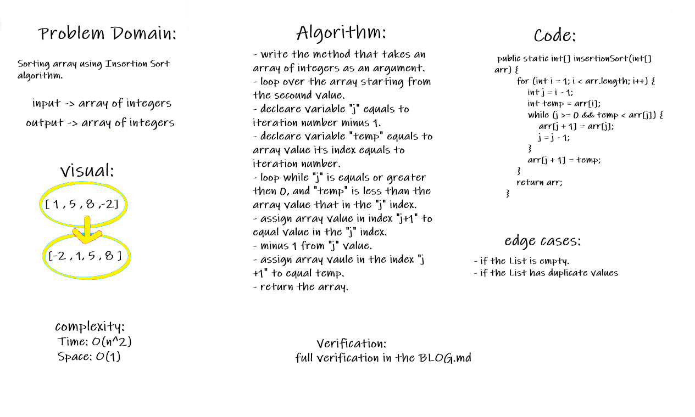

# Challenge Summary

Sorting array using Insertion Sort algorithm.

Document explanation by creating a blog article that shows the step-by-step output after each iteration through some sort of visual.

testing implementation of Insertion Sort based on the pseudocode provided.

## Whiteboard Process

## Approach & Efficiency

for and while loop:

- **Time: `O(n^2)`:**

- **Space: `O(1)`:**

> **Full verification and Efficency in the [BLOG](./BLOG.md)**