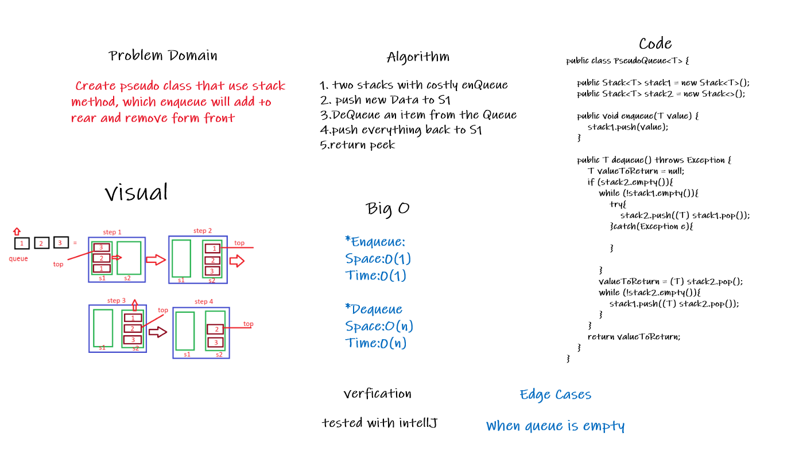

# Stacks and Queues

## Challenge

### Stack :-
Create a Stack class that has a top property. It creates an empty Stack when instantiated.method to push new node at top of the stack.method to remove node from item form top of stack. peak method to return top value in stack.

### Queue :-

Create a Queue class that has a front property. It creates an empty Queue when instantiated. enqueue method to add new node at back. dequeue method to remove node from front of th queue. peak method to identify front node in queue.

## Approach & Efficiency

- Space: O(1)
- Time: O(1)

## API

#### Stack Methods:

1. push():adds  new node  that have  value of the top of the stack with  O(1) Time and space performance.

2. pop(): Removes  node from  top of the stack should raise exception when called on empty stack peek, and Returns the value from node from the top of the stack.

2. peek(): Returns Value of the node located at the top of the stack. Should raise exception when called on empty stack.

4. is empty(): Returns Boolean indicating whether or not the stack is empty.

#### Queue Methods:

1. enqueue():adds a new node with that value to the back of the queue with an O(1) Time performance.

2. dequeue(): Removes the node from the front of the queue. Should raise exception when called on empty queue. Returns: the value from node from the front of the queue.

3. peek(): Returns Value of the node located at the top of the queue. Should raise exception when called on empty queue.

4. is empty(): Returns Boolean indicating whether the queue is empty.

## Code Challenge 11:

# Challenge Summary

Create pseudo class that use stack method, which enqueue will add to rear and remove form front

## Whiteboard Process

## Approach & Efficiency

enqueue

Space : O(1)
Time : O(1)

dequeue

Space : O(n)
Time : O(n)

## Solution:

`public class PseudoQueue<T> {

    public Stack<T> stack1 = new Stack<T>();
    public Stack<T> stack2 = new Stack<>();

    public void enqueue(T value) {
        stack1.push(value);
    }

    public T dequeue() throws Exception {
        T valueToReturn = null;
        if (stack2.empty()){
            while (!stack1.empty()){
                try{
                    stack2.push((T) stack1.pop());
                }catch(Exception e){

                }

            }
            valueToReturn = (T) stack2.pop();
            while (!stack2.empty()){
                stack1.push((T) stack2.pop());
            }
        }
        return valueToReturn;
    }
}`

